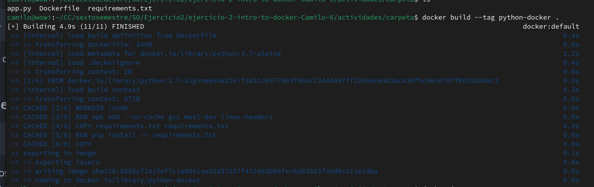
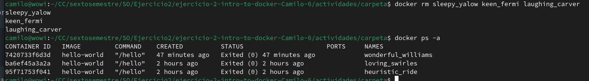
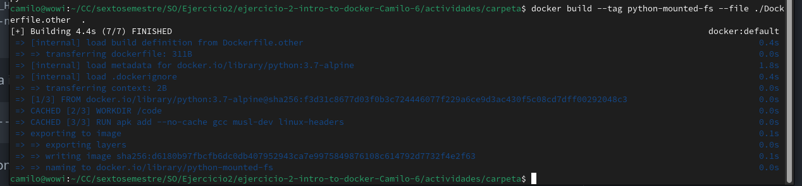
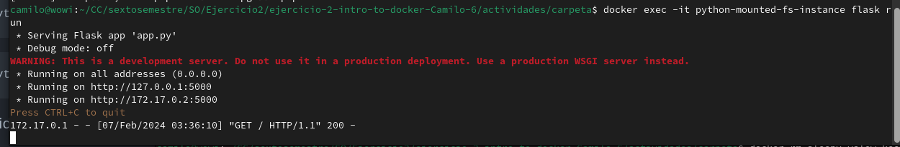

La herramienta me parece interesante, aunque todavia me parece algo complicada de entender (los videos ayudan pero no tanto)
La instalacion fue sencilla, solo unos pequeños problemas para hacer que no necesitara sudo para los comandos de docker
Las actividades a realizar fueron faciles, solo un poco extrañas (ya que no las entiendo del todo), creo que era algo de ambientas (apenas lo estamos viendo en otra materia)

capturas
paso 5

paso 16

paso 18

